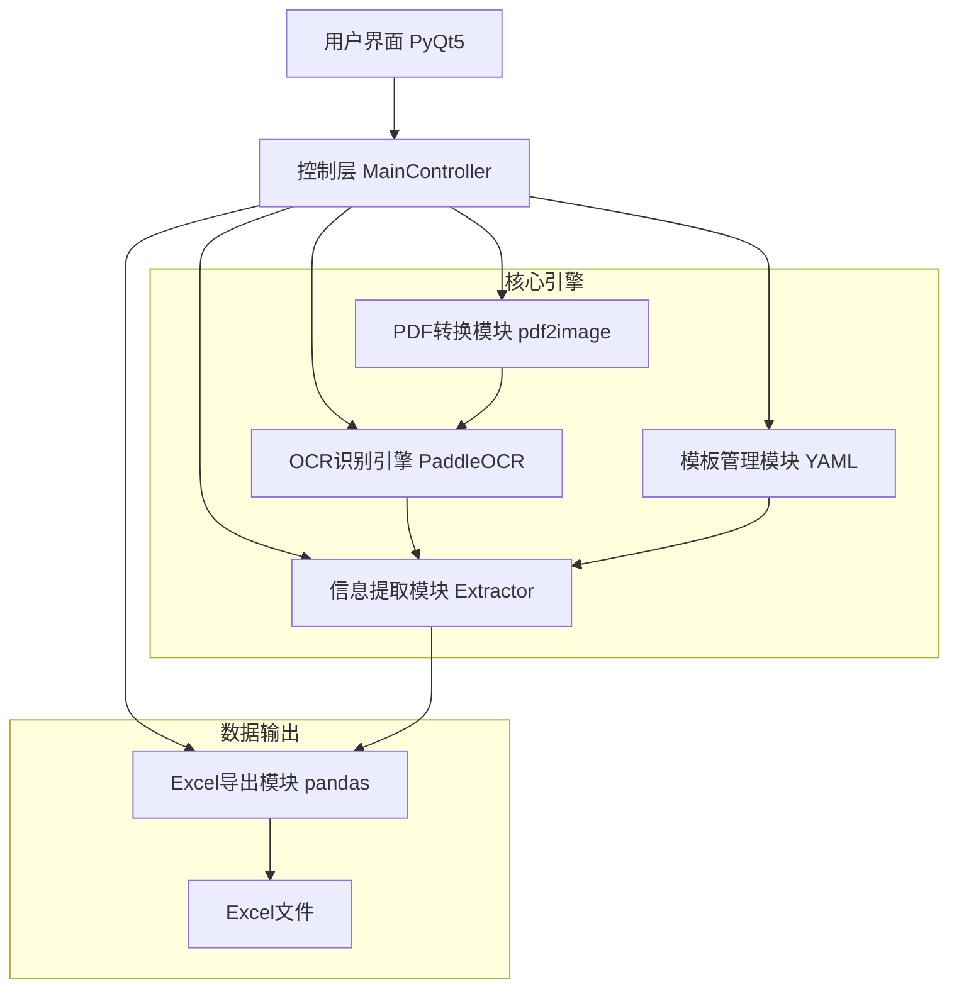
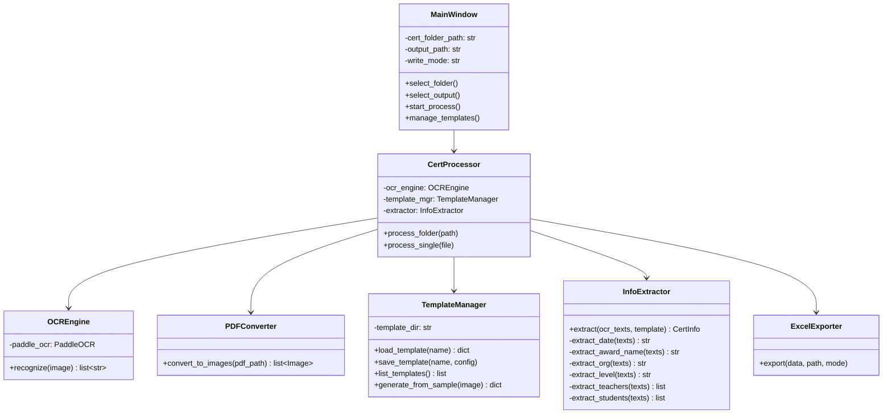
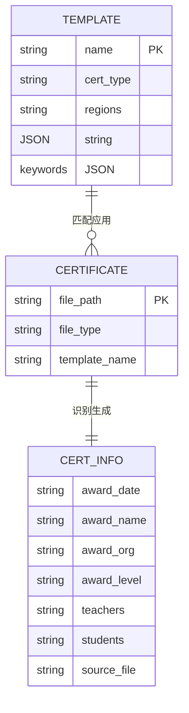

# 比赛证书自动识别管理系统 - 项目设计文档

## 1. 系统架构

## 2. 模块设计

## 3. 数据流 ER 图

## 4. 接口清单

| 模块 | 方法 | 说明 |
|------|------|------|
| PDFConverter | `convert_to_images(pdf_path)` | PDF转图片列表 |
| OCREngine | `recognize(image_path)` | OCR识别返回文本列表 |
| TemplateManager | `load_template(name)` | 加载YAML模板 |
| TemplateManager | `save_template(name, config)` | 保存YAML模板 |
| TemplateManager | `list_templates()` | 列出所有模板 |
| TemplateManager | `generate_from_sample(image, regions)` | 交互式生成模板 |
| InfoExtractor | `extract(ocr_texts, template)` | 从OCR文本提取结构化信息 |
| ExcelExporter | `export(data, path, mode)` | 导出Excel(追加/覆盖) |
| CertProcessor | `process_folder(path)` | 批量处理文件夹 |

## 5. UI/UX 规范

- **主色调**: `#2563EB` (蓝) / `#1E40AF` (深蓝)
- **辅助色**: `#10B981` (成功绿) / `#EF4444` (错误红) / `#F59E0B` (警告黄)
- **背景色**: `#F1F5F9` (浅灰蓝)
- **卡片背景**: `#FFFFFF`，圆角 `8px`，阴影 `0 2px 8px rgba(0,0,0,0.08)`
- **字体**: 系统默认，标题 `16px bold`，正文 `14px`，辅助 `12px`
- **间距**: 统一 `8px / 16px / 24px` 递进
- **按钮**: 圆角 `6px`，hover 加深 10%，点击有 loading 动画
- **反馈**: 操作成功/失败均有 Toast 提示
